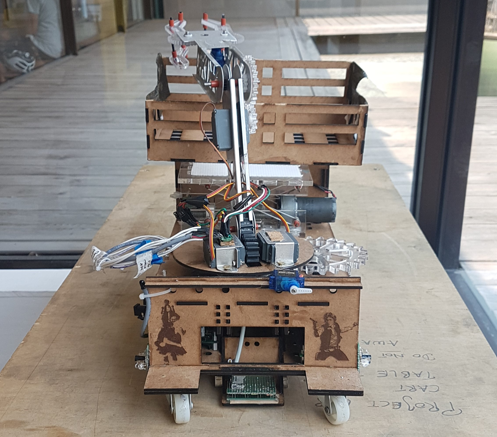
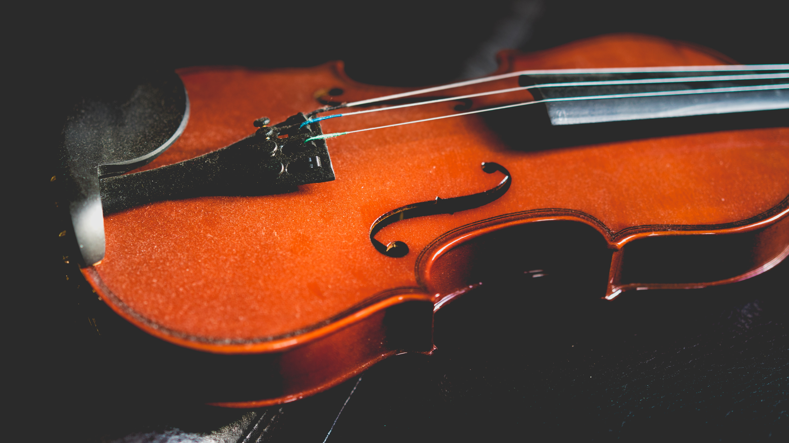

## About

I am a fourth year engineering student at UBC with a variety of experience in mechanical design, data analysis, and software development. I strive fully apply myself to everything I do and make sure that what I produce from my work, volunteering, and hobbies is something I am proud of.

[Resume](https://masottile.github.io/resume.pdf) | [LinkedIn](https://www.linkedin.com/in/masottile/)

## Projects
### Han Yolo: autonomous robot
May-August 2018

Check out my project [website](https://hanyolo-shootsfirst.github.io/).

With some of my classmates, I built a fully autonomous robot, named Han Yolo in honor of our Star Wars themed competition. Han had to traverse an obstacle course and attempt to rescue stuffed Ewoks. One day I gave Han a time parameter that was off by a factor of 10 and sent our robot full speed, backwards off a table; I was so thankful it survived.

### Duet with Me: music accompaniment app
January 2019

Check out the project [here](https://devpost.com/software/duetwithme-fu9y5p).

While I've never been an outstanding musician, I have played the Viola for over ten years. I came up the idea of building a voice-controlled computer accompaniment because playing solo music is never as much fun as playing a duet. I was lucky to find a hackaton team with the necessary skills to help me realize this project.

## Volunteering
### Tutoring Director: Engineering Undergraduate Society
September 2018 - Present

Outside of courses, you can find me running [EUS Tutoring](https://ubcengineers.ca/tutoring) sessions for most math and physics courses taken by first year engineering students. I've always had a passion for learning a teaching, and I find it quite fulfilling to run a service that helps my peers succeed in their academics.

## Art
When I get extra bored, I like to paint things or get a little creative with my baking. I surprised some of my high school classmates by going into engineering instead of dropping out to sell art full time.

