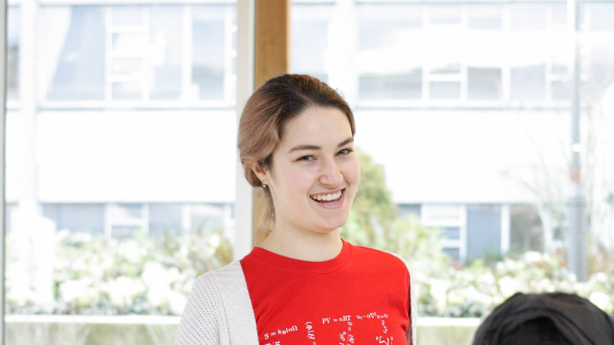

## About

I am a fourth year engineering student at UBC with prior experience in mechanical design, data analysis, and software development.

[Resume](https://masottile.github.io/resume.pdf) | [LinkedIn](https://www.linkedin.com/in/masottile/)

## Projects
[Han Yolo](https://hanyolo-shootsfirst.github.io/)

With some of my classmates, I built a fully autonomous robot, named Han Yolo in honor of a Star Wars themed competition. I still remember the day I messed up a parameter by a factor of 10 and sent our robot full speed, backwards off a table; I was so thankful it survived.

## Activities
[EUS Tutoring](https://ubcengineers.ca/tutoring)

Outside of courses, you can find me running tutoring sessions for the Engineering Undergraduate Society. We cover most math and physics courses taken by first year engineering students.

## Art
When I get extra board, I like to paint things or get a little creative with my baking. I surprised some of my high school classmates by going into engineering instead of dropping out to sell art full time.

